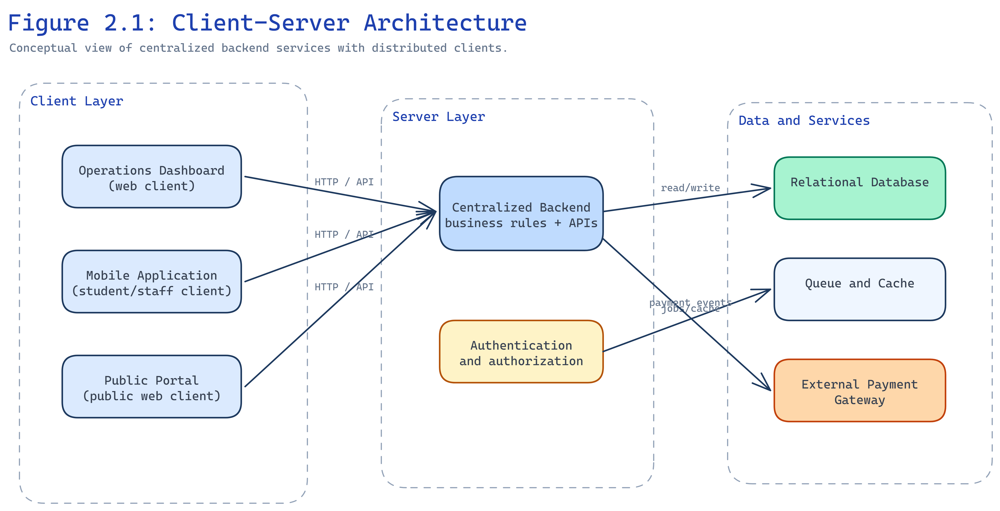
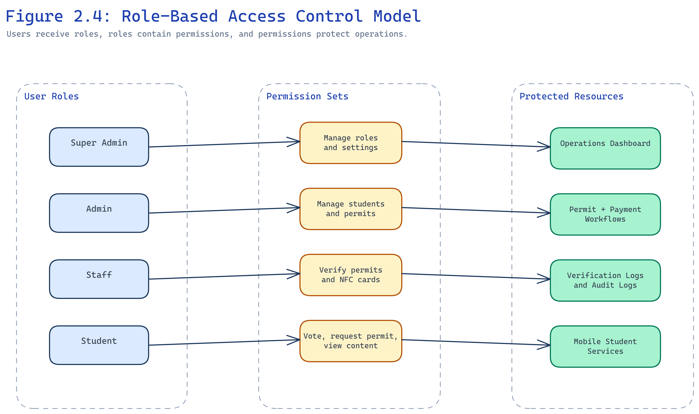
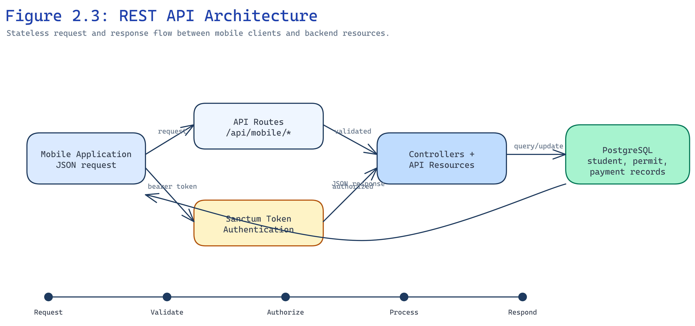
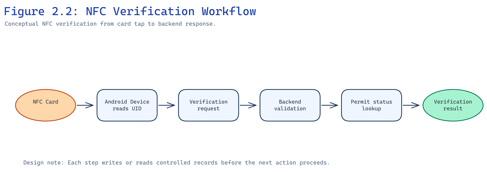

# CHAPTER TWO — LITERATURE REVIEW AND REVIEW OF RELATED SYSTEMS

## 2.1 Introduction

Chapter One established the need for an NFC-based student permit verification and governance management system for Knutsford University. The chapter described the operational problems created by manual permit checks, fragmented student governance workflows, weak auditability, limited mobile access, and disconnected election and payment processes. This chapter builds on that foundation by reviewing the concepts, technologies, and related systems that inform the design of the proposed system.

A literature review in a technical project should do more than list definitions. It should explain the ideas that guide the system design, show why those ideas matter, and identify the gaps that remain in existing approaches. For this project, the review focuses on client-server systems, role-based access control, mobile application architecture, REST API communication, digital identity verification, contactless authentication, electronic voting, web and mobile frameworks, relational databases, payment gateways, queue and cache systems, and API authentication. These areas are directly connected to the proposed student governance platform because the system must support several coordinated workflows rather than one isolated feature.

The chapter is organized into four main parts. The first part presents the theoretical framework for the proposed system. It discusses the architectural and security principles that support the design of the dashboard, public portal, mobile application, mobile API, NFC verification workflow, and election module. The second part reviews the main technologies used in the project and explains why each technology is relevant to the system. The third part examines categories of existing systems, including student permit systems, university election systems, student identity verification systems, and NFC attendance or verification systems. The final part identifies gaps in the reviewed systems and explains how those gaps justify the proposed platform.

This chapter uses verified APA-style in-text citations for established publications, standards, and official documentation. Topics that still require additional peer-reviewed literature remain marked with `[VERIFY SOURCE]` until those sources are confirmed in `REFERENCES_MASTER.md` and added to `REFERENCES_VERIFIED.md`.

## 2.2 Theoretical Framework

The theoretical framework provides the concepts that guide the structure and behavior of the proposed system. Since the project combines administrative workflows, identity verification, payment confirmation, mobile access, and election voting, no single theory is sufficient on its own. The system draws from several areas of computing: distributed systems, access control, mobile architecture, API design, identity verification, contactless authentication, and electronic voting.

These concepts are connected by a common concern: how to manage institutional actions in a controlled digital environment. A permit should be issued only under valid conditions. A payment should be verified before a permit request is completed. A student should vote only when eligible. A verification officer should see only the information needed for the verification task. An audit log should preserve evidence of sensitive actions. The following sections explain the theoretical basis for these requirements.

### 2.2.1 Client-server architecture

Client-server architecture is a computing model in which client applications request services from a centralized server or backend system. The client may be a web browser, mobile application, desktop application, or another software component. The server processes requests, applies business rules, manages authentication, communicates with the database, and returns responses to the client. This model is common in institutional information systems because it allows shared data and rules to be managed centrally while still providing different access interfaces to users. (Tanenbaum & Wetherall, 2011)

In a student governance system, centralization has practical value. Permit records, payment statuses, student accounts, verification logs, election records, and published content must remain consistent. If each access channel keeps its own separate record, the system can produce conflicting results. For example, a student might appear to have an active permit in one spreadsheet but not in another. A payment could be marked successful in a receipt folder while the permit record remains pending. Client-server architecture reduces this problem by placing the authoritative data and business rules on the backend.

The proposed system uses this architectural idea by treating the backend as the central coordination layer for the operations dashboard, public portal, and mobile application. The dashboard supports administrative work by authorized users. The public portal exposes approved public information and self-service permit request pages. The mobile application provides student and staff access to selected functions. Although these clients serve different user groups, they depend on the same backend rules for authentication, permit handling, payment verification, election voting, audit logging, and reporting.

Figure 2.1 illustrates the general relationship between the dashboard, mobile application, public portal, backend services, database, queue workers, cache, and payment gateway. The figure does not include database schema details, because those are more appropriate for Chapter Three.

Client-server architecture also supports maintainability. When the rules for permit issuance or election eligibility change, the update can be made in the backend rather than duplicated across several user interfaces. This is especially relevant in a governance system where institutional policies may change over time. A centralized backend can enforce the same rule whether the request comes from the dashboard, mobile application, or public portal.

Another strength of the model is scalability by separation of responsibilities. The client interface can focus on presentation and user interaction, while the server handles validation, authorization, persistence, and integration with external services such as payment gateways. This separation does not automatically make a system scalable, but it creates a structure that can be improved through caching, queue workers, database indexing, and deployment changes as demand increases.

The model has limitations. A client-server system depends heavily on network availability. If users cannot reach the server, most workflows become unavailable unless the system provides offline support. Centralized systems also require careful security design because the backend becomes a major point of control. If authentication, authorization, or validation is weak, many connected workflows may be affected. These limitations are relevant to the proposed system, especially because NFC verification and mobile access may occur in environments where internet connectivity varies.

Despite these limitations, client-server architecture suits the proposed student governance platform because the project requires consistent records across multiple access channels. A manual or fully decentralized approach would make auditability and verification more difficult. The centralized backend provides a foundation for managing permits, payments, elections, identity records, and reporting within a single operational structure.

### 2.2.2 Role-based access control (RBAC)

Role-Based Access Control (RBAC) is an authorization approach in which permissions are assigned to roles, and users receive permissions through their assigned roles. Instead of granting every permission directly to each user, the system groups permissions according to responsibilities. For example, an administrator may manage users and system settings, a staff member may verify permits, an executive may publish governance content, and a student may view personal records or participate in eligible elections. (Sandhu et al., 1996)

RBAC is useful in institutional systems because different users should not have equal access to all functions. Student governance workflows include sensitive actions such as issuing permits, verifying payments, approving candidates, registering NFC cards, publishing documents, and viewing reports. If the system allows all authenticated users to perform these actions, it creates security and accountability problems. Role separation helps limit access according to actual responsibility.

The principle of least privilege is closely related to RBAC. It states that users should receive only the permissions needed to perform their duties. In the proposed system, this principle matters because student records, payment information, election data, and verification logs may contain sensitive or operationally important information. A student should not be able to approve candidates or change permit settings. A verification officer should not automatically have authority to manage system roles. An executive may publish announcements but may not need access to every payment recovery function. These distinctions reduce misuse and accidental damage.

RBAC also supports accountability. When actions are tied to authenticated users and permission checks, audit logs become more meaningful. It is not enough to know that a permit was issued. The system should be able to identify which authorized user issued it, under what role, and when. This is particularly relevant in student governance because disputes about permits, payments, elections, and published information may require review.

In the proposed system, RBAC relates to administrative roles, staff roles, executive permissions, and student access. Administrators may configure roles and manage sensitive settings. Staff may perform operational tasks such as verification or permit handling. Executives may manage SRC-related content and review operational summaries depending on assigned permissions. Students use the system for personal workflows such as permit requests, permit status viewing, and election participation. These role boundaries help keep the system organized.

Figure 2.4 presents the role-based access control model used to separate administrative, staff, executive, and student responsibilities. The model shows that users do not receive unrestricted system access simply because they are authenticated; instead, their assigned roles determine the permissions available to them.

RBAC is not a complete security solution by itself. Poorly designed roles can become too broad, giving users more authority than required. Too many roles can also make administration difficult. A system may pass a role check but still expose too much data if the underlying query or response is not properly scoped. Therefore, RBAC must be combined with validation, authentication, data filtering, audit logging, and secure defaults. (OWASP Foundation, 2021)

For this project, RBAC provides a practical model for controlling institutional workflows. It aligns well with the structure of a university environment, where responsibilities are already separated across students, SRC executives, staff, and administrators. It also gives the proposed system a clear security foundation before more detailed implementation decisions are made in later chapters.

### 2.2.3 Mobile application architecture

Mobile application architecture concerns the organization of software that runs on mobile devices and communicates with backend services. A mobile application usually includes user interface components, local state handling, network communication, authentication, error handling, and sometimes offline storage. In student-facing systems, mobile architecture also involves usability, device compatibility, screen size variation, and network reliability.

Mobile-first thinking has become relevant in educational institutions because many students interact with digital services through smartphones rather than desktop computers. A student may check announcements, submit a request, confirm a payment, or vote in an election from a mobile device. For staff and security personnel, a mobile device may also be more practical for verification because permit checks can occur away from an office environment.

Cross-platform mobile development allows one codebase to target more than one mobile operating system. Frameworks such as React Native and Expo are commonly used for this purpose because they allow developers to build mobile interfaces with JavaScript or TypeScript while still accessing native mobile capabilities through supported APIs. (Meta, n.d.-b; Expo, n.d.) The main advantage is development efficiency, especially for academic projects or institutions with limited resources.

The proposed system benefits from a mobile application because several workflows naturally fit mobile use. Students can view permit information, initiate permit requests, access governance content, and participate in election voting without depending entirely on desktop access. Authorized staff can use mobile-assisted verification, including NFC scanning where device support is available. This helps connect the verification task to the actual context in which verification occurs.

Mobile architecture also raises design concerns. A mobile application should not contain sensitive business rules that can be bypassed by modifying the client. Rules such as permit eligibility, payment verification, vote eligibility, and role authorization should remain on the backend. The mobile application should request data and submit actions through authenticated API endpoints, while the backend enforces the final decision. This separation is central to the proposed system because student governance workflows require trust in the server-side records.

Usability is another concern. A student mobile application should present information clearly and avoid unnecessary complexity. Election voting, permit status viewing, and payment-related actions must be easy to understand because user confusion can produce support requests and disputes. For verification staff, the interface should show enough information to make a decision without exposing unnecessary private data. These issues will become more detailed in the system design chapter.

Mobile systems have limitations. They depend on device compatibility, network connectivity, operating system restrictions, and user device availability. NFC support also varies across devices. Some students may not have compatible smartphones, and some verification activities may occur in places with poor internet access. For this reason, the proposed system does not rely only on the mobile application. It includes the operations dashboard and public portal as additional access channels, with alternative verification methods where NFC is unavailable.

In this project, mobile application architecture supports accessibility and operational flexibility. It does not replace the backend, dashboard, or public portal. Instead, it extends the student governance platform to mobile contexts while depending on the backend for secure processing and consistent records.

### 2.2.4 REST API architecture

Representational State Transfer (REST) is an architectural style commonly used for web APIs. RESTful APIs expose resources through structured endpoints and usually use HTTP methods such as GET, POST, PATCH, and DELETE to retrieve or modify data. In many modern systems, REST APIs exchange data in JavaScript Object Notation (JSON), making them suitable for communication between backend servers and web or mobile clients. (Fielding, 2000)

REST API architecture supports interoperability because different clients can communicate with the same backend using agreed request and response structures. A mobile application, public portal, and dashboard can each request information from the backend while presenting that information differently to users. This fits the proposed system because student governance workflows involve multiple access surfaces but must preserve consistent backend rules.

Stateless communication is an important REST principle. In a stateless API, each request contains the information needed for the server to understand and process it, commonly through authentication tokens, request parameters, and payload data. The server does not depend on hidden client state from previous requests. This can improve scalability because requests can be handled more consistently across server processes. It also makes API behavior easier to test and document.

In the proposed system, REST API principles are most relevant to the mobile API. The mobile application requires endpoints for authentication, student profile access, permit information, permit request creation, payment verification, election voting, and staff operations. These endpoints must return predictable responses, handle validation errors clearly, and apply authorization rules consistently. A well-structured API reduces ambiguity between the mobile application and backend.

Figure 2.3 illustrates the REST API communication model between the mobile application, authenticated API layer, backend processing logic, and database. It emphasizes that the mobile application submits requests, while the backend remains responsible for validation, authorization, and persistence.

REST API design also supports separation between presentation and business logic. The mobile application can focus on displaying screens and collecting user input, while the backend validates the request and applies institutional rules. For example, when a student attempts to vote, the mobile application may submit the selected candidate, but the backend must confirm that the election is active, the candidate is approved, the student is eligible, and the student has not already voted for that position.

The main weakness of API-driven systems is that poorly designed APIs can expose sensitive data or allow unauthorized actions. A public endpoint may return internal fields that should remain private. An authenticated endpoint may fail to check whether the user has permission to access a record. Rate limits may be needed for sensitive operations such as login, payment verification, or repeated verification attempts. These concerns show that REST architecture must be paired with authentication, authorization, input validation, response shaping, and logging.

For the proposed student governance platform, REST API architecture provides a practical communication model between the centralized backend and mobile application. It supports the system's need for structured, testable, and secure communication while allowing the dashboard and public portal to use their own interface patterns.

### 2.2.5 Digital identity verification systems

Digital identity verification systems are used to confirm that a person, account, card, or presented identifier corresponds to an authorized record. In educational institutions, identity verification may be required for examinations, library access, permit checks, student service requests, elections, and administrative approvals. A digital identity system usually depends on stored identity records, authentication credentials, verification identifiers, and rules for determining whether a person is eligible for a service. (National Institute of Standards and Technology, 2017)

Authentication and verification are related but different concepts. Authentication confirms that a user can prove control of an account or credential, such as a password or token. Verification checks whether a presented identity or permit is valid for a specific purpose. A student may authenticate into a mobile application, but permit verification may still require checking whether the student has an active permit for the current academic period. Similarly, an NFC card may identify a linked student record, but the system must still verify whether the associated permit is valid.

Student identity systems must handle several practical issues. A student record may include name, student number, programme, level, academic period, permit history, account status, and linked cards. These details can change over time. A student may lose a card, change level, require account activation, or request a permit for a new academic period. A reliable verification system should avoid treating identity as a single static field. It should connect identity to lifecycle events.

Digital identity verification also raises privacy concerns. Verification staff may need enough information to confirm a student, but they do not always need full personal details. A system should avoid exposing unnecessary information during verification. For example, a verification result may need to show student name, student number, permit status, and permit validity, but not unrelated account or payment history. This approach reduces privacy risk while still supporting the operational task.

In the proposed system, digital identity verification is expressed through permit verification, NFC card association, student number verification, permit code verification, account activation, and authenticated mobile access. A student's record becomes the central reference point for these workflows. The system can then connect permit status, payment status, card status, and election eligibility to that record.

Digital verification systems are not free from error. Incorrect student data, duplicate records, expired permits, lost cards, or weak account recovery procedures can affect reliability. For this reason, verification systems should support administrative correction, audit logs, and clear status categories. The proposed system addresses this by treating verification as part of a larger governance platform rather than as an isolated lookup tool.

The relevance of digital identity verification to this study is direct. Permit fraud, impersonation, and slow manual checks were identified as problems in Chapter One. A structured digital verification model helps address these issues by connecting the presented identifier to authoritative records and by preserving evidence of verification events.

### 2.2.6 Contactless authentication systems

Contactless authentication systems allow users or objects to be identified without inserting a card or manually entering all details. They commonly use technologies such as Near Field Communication (NFC), Radio Frequency Identification (RFID), contactless smart cards, or mobile wallet credentials. In this study, the focus is on NFC because it can be used with compatible mobile devices and registered cards to support student permit verification.

NFC is a short-range wireless communication technology. It operates over a very limited distance, typically requiring the reader and card or tag to be placed close together. This short range makes it practical for intentional interactions, such as tapping a student card against a verification device. NFC systems usually involve a reader device and a card or tag that contains an identifier or data payload. (NFC Forum, n.d.)

The main advantage of NFC in institutional verification is speed. A verification officer can scan a card rather than manually typing a student number or searching through paper records. This is useful in situations where many students must be checked within a limited time. NFC can also reduce typing errors because the identifier is read directly from the card. In a student permit context, the scan can trigger a lookup that checks the linked student, card status, and permit status.

NFC also supports a more structured user experience. Instead of asking a student to present several documents, the verifier can scan one registered card and receive a system-generated response. This response can show whether the card is active, whether the student is linked correctly, and whether the permit is valid. When combined with audit logging, each verification event can become part of the operational record.

The security of NFC systems depends heavily on design. A common mistake is to treat the presence of an NFC card as proof of authorization. In reality, an NFC card may be lost, copied in some contexts, misused, or linked to an outdated record. A secure design should not rely only on the raw card identifier. It should check the card lifecycle status, linked student, permit validity, and relevant institutional rules. (Google, n.d.; OWASP Foundation, 2021)

Another issue is data exposure. If raw NFC identifiers are stored or displayed carelessly, they may become sensitive operational data. A more careful approach is to store a protected representation, such as a hashed form, so that the system can compare scanned identifiers without unnecessarily exposing the raw value. The exact protection method depends on implementation design, but the principle is that identifiers used for verification should be handled as sensitive data.

NFC systems also face hardware and platform limitations. Not all mobile devices support NFC. Among devices that support it, the reading behavior may differ depending on the operating system, manufacturer, and application permissions. Some platforms restrict background scanning or writing to cards. This means that an NFC-based verification system should include fallback methods such as permit code or student number verification. A system that depends only on NFC may fail in ordinary operational conditions.

Institutional use cases for NFC include attendance tracking, library access, room access, identity checks, payment cards, and event admission. In each case, the value of NFC comes from connecting a quick physical interaction to a trusted backend decision. The backend decision remains essential. A card tap should initiate verification, not replace verification.

Figure 2.2 shows a high-level NFC verification workflow: card tap, identifier reading, backend lookup, card status check, student record lookup, permit status check, verification response, and audit log entry. Detailed database relationships are reserved for Chapter Three.

For the proposed system, NFC is used to improve student permit verification. A registered NFC card can be linked to a student record. During verification, the card is scanned using a compatible device, and the system checks whether the card and related permit are valid. This approach is stronger than visual inspection because the verification response comes from current system records. It is also more practical than a purely manual lookup because the scan reduces the time needed to identify the student.

NFC does not solve all verification problems. It cannot guarantee internet access, prevent all forms of card misuse, or replace institutional rules for permit eligibility. It also requires card management processes such as registration, replacement, revocation, and lost-card handling. The proposed system accounts for these limitations by treating NFC as one verification channel within a wider identity and permit management platform.

### 2.2.7 Electronic voting systems

Electronic voting systems allow voters to cast votes using digital devices or software platforms. In institutional settings, they may be used for student elections, association elections, board elections, surveys, or referenda. A proper electronic voting system must address authentication, eligibility, ballot presentation, vote recording, duplicate prevention, result calculation, and auditability. (ACE Electoral Knowledge Network, n.d.)

Student elections require more control than ordinary polls. A poll may allow flexible participation or opinion gathering, but an election determines representation. Therefore, the voting process must be designed to prevent duplicate voting, restrict ineligible participation, manage candidate approval, and preserve result integrity. The system should also distinguish between active, scheduled, closed, and archived elections.

Transparency in electronic voting does not mean exposing individual votes. It means that the process should be understandable and reviewable. Eligible students should know when an election is open, which candidates are approved, and how results become visible. Administrators and election managers should be able to confirm that the system enforced one vote per eligible voter where required. Audit logs may record that a voting action occurred, but vote secrecy and privacy must still be considered depending on institutional rules.

Authentication is central to electronic voting. A system must know who is voting before it can enforce eligibility. For a student governance election, eligibility may depend on student status, account activation, permit status, academic period, or other rules defined by the institution. Authentication alone is not enough; an authenticated user may still be ineligible to vote in a specific election. This distinction is important because it prevents the system from treating login as automatic voting permission.

Vote integrity requires careful handling of duplicate voting and vote modification. Some voting systems allow changes before the election closes, while others make votes immutable once cast. For student governance elections, immutable voting can reduce disputes because a completed vote cannot later be changed casually. It also demands clear user interface design so that voters understand the consequence before submission.

Electronic voting systems have limitations. They can be affected by poor authentication, weak eligibility rules, unclear ballot design, network failure, device access problems, and distrust of digital results. A system may be technically correct but still face questions if users do not understand how it works. For that reason, electronic voting must combine technical enforcement with clear communication and administrative procedures.

The proposed system includes an election voting module for student governance. It supports election setup, candidate approval, eligibility checks, mobile voting, and result visibility. The system treats election voting separately from informal polling because the risk and governance meaning are different. This distinction is important for preserving the credibility of student elections within the platform.

## 2.3 Technological Review

The technological review examines the major tools and platforms relevant to the proposed system. The purpose is not to praise the tools or provide general tutorials. The aim is to explain how each technology supports the requirements identified in Chapter One and the theoretical concepts discussed earlier in this chapter.

The proposed system uses a backend-centered architecture with web, public, and mobile access channels. It therefore requires technologies for backend routing and business logic, frontend user interfaces, mobile application development, persistent data storage, NFC interaction, payment verification, asynchronous processing, caching, and API authentication. The following subsections review these technologies in relation to the proposed system.

### 2.3.1 Laravel framework

Laravel is a PHP web application framework that supports routing, controllers, middleware, validation, authentication, database access, queues, events, notifications, and API development. It follows patterns commonly associated with Model-View-Controller (MVC) architecture, although modern Laravel applications may also use actions, services, policies, form requests, and frontend integration tools. (Laravel, n.d.-a)

Laravel is relevant to the proposed system because the project requires a backend capable of handling several modules. These include students, permits, payments, NFC cards, verification logs, elections, announcements, documents, audit logs, reports, and mobile API endpoints. A framework with established support for routing, validation, authorization, database models, and background jobs reduces the amount of low-level infrastructure that must be built manually.

Security support is another reason Laravel fits this type of project. Institutional systems require authentication, password handling, session protection, authorization checks, request validation, and protection against common web vulnerabilities. A framework does not automatically make an application secure, but it provides tested mechanisms that developers can apply consistently. For example, middleware can protect routes, policies can authorize actions, and validation classes can reject malformed input before it reaches domain logic.

Laravel's queue support is also relevant. Some operations should not delay a user's request. Notifications, some reporting tasks, and background processing can be handled asynchronously through queue workers. In a student governance system, this is useful because the dashboard and mobile application should remain responsive while background tasks are processed separately.

Laravel is well suited to API development. The proposed mobile API requires authenticated endpoints, JSON responses, validation errors, pagination, and policy enforcement. Laravel provides tools for building such endpoints and for sharing domain rules across web and mobile workflows. This is important because permit issuance, payment verification, and election voting should not behave differently simply because the request comes from a different client.

The framework has limitations. Laravel applications require careful design to avoid overly large controllers, duplicated validation logic, and poorly organized models. Performance also depends on database design, caching, query optimization, queue configuration, and deployment choices. A framework provides structure, but it does not replace architectural discipline.

For this project, Laravel provides a practical backend foundation. It supports the centralized server role described in the client-server framework and allows the project to combine dashboard operations, public portal access, mobile API endpoints, payment verification, audit logging, and queue processing under one backend system.

### 2.3.2 React and Inertia.js

React is a JavaScript library for building component-based user interfaces. It allows developers to divide an interface into reusable components that manage presentation and interaction. Inertia.js is a tool that connects server-side frameworks such as Laravel with modern frontend frameworks such as React. It allows applications to feel closer to single-page applications while still using server-side routing and controllers. (Meta, n.d.-a; Inertia.js, n.d.)

This combination is relevant to dashboard development. Administrative dashboards often require tables, filters, forms, dialogs, status indicators, charts, and detail pages. React's component model supports reusable interface elements, while Inertia.js allows the backend to send page data directly to frontend components without building a completely separate API for every dashboard screen.

In a student governance platform, the dashboard is not a public marketing page. It is an operational interface. Users need to search students, manage permits, review payments, register NFC cards, approve candidates, publish documents, and inspect audit logs. A component-based frontend helps maintain consistency across these modules. For example, status badges, search fields, form dialogs, and confirmation modals can follow consistent behavior across the system.

Inertia.js also simplifies some full-stack workflows. Instead of maintaining separate client-side routing and independent API endpoints for every dashboard page, the system can use server-side routes that return frontend page components with data. This can reduce complexity for a project where the dashboard is tightly connected to Laravel's authorization and validation mechanisms.

The approach has tradeoffs. A dashboard built with React and Inertia.js still requires careful frontend organization. Large components can become difficult to maintain. Server-provided data must be shaped properly so that the frontend does not receive unnecessary internal fields. Browser performance can also suffer if large tables or complex pages are not handled carefully. These concerns must be managed through component design, pagination, filtering, and clear data contracts.

For the proposed system, React and Inertia.js support the operations dashboard by combining modern interactive interfaces with Laravel-controlled routing and backend rules. This helps the dashboard remain consistent with the centralized governance model described earlier.

### 2.3.3 Expo React Native

Expo React Native is a development platform for building cross-platform mobile applications using React Native. React Native allows developers to write mobile interfaces using JavaScript or TypeScript while rendering native mobile components. Expo provides tooling, libraries, build services, and development workflows that simplify mobile application creation and testing. (Expo, n.d.; Meta, n.d.-b)

The relevance of Expo React Native to this project is tied to mobile access. The proposed system includes a mobile application for student and staff workflows. Students may use the mobile application to access permit information, view relevant governance content, submit permit requests, and participate in eligible elections. Staff may use mobile workflows for verification activities. A cross-platform approach is suitable because the project should not be limited to a single operating system where avoidable.

Expo supports rapid iteration, which is useful in an academic project. Mobile applications often require frequent testing on different screens and devices. Development tools that simplify previewing, debugging, and building reduce the overhead involved in mobile work. This matters because the mobile application is one part of a wider system that also includes backend, dashboard, public portal, payment verification, NFC handling, and reporting.

Mobile deployment still has constraints. Access to device features such as NFC depends on platform support, permissions, and compatible libraries. Some features may behave differently on Android and iOS. Build and distribution processes also require configuration. The proposed system must therefore design mobile workflows with realistic device constraints in mind, especially for NFC scanning.

The mobile application should also avoid becoming the authority for sensitive rules. It may collect user input and display results, but permit eligibility, vote eligibility, payment verification, and authorization decisions should remain on the backend. Expo React Native supports the client side of the architecture, while the Laravel backend remains responsible for trusted decisions.

In this project, Expo React Native provides a practical way to extend the student governance platform to mobile devices. Its value is strongest where students and verification staff need access away from a desktop environment.

### 2.3.4 PostgreSQL

PostgreSQL is an open-source relational database management system known for structured data storage, transactional consistency, constraints, indexing, and support for complex queries. Relational databases are suitable for systems where records have clear relationships and where data integrity is important. (PostgreSQL Global Development Group, n.d.)

The proposed system contains many related entities: users, students, academic periods, permits, permit requests, payments, NFC cards, verification logs, audit logs, announcements, events, documents, polls, elections, candidates, and votes. These records are connected. A permit belongs to a student. A payment may be linked to a permit request. An NFC card is associated with a student. A vote is tied to an election position and candidate. A relational database provides a structured way to manage these relationships.

Transactional consistency matters in permit issuance and voting. When a permit request is completed, the system may need to update payment status, request status, and permit records in a coordinated way. If one step succeeds and another fails, the database can become inconsistent unless transactions are used properly. Similarly, election voting requires safeguards against duplicate votes. A relational database can support uniqueness constraints and transaction handling that reduce the risk of conflicting records.

PostgreSQL also supports audit and reporting requirements. Audit logs may contain structured records of actions, actors, timestamps, and affected models. Reports may require filtering by academic period, permit status, payment status, verification method, or election. A relational database with appropriate indexes can support these queries more reliably than scattered spreadsheets or file-based records.

The limitations of relational databases should still be acknowledged. A poorly designed schema can make future changes difficult. Missing indexes can slow queries. Overly complex relationships can make reporting harder. Data integrity depends on the correct use of constraints, validation, and application logic. PostgreSQL provides the tools, but the system design must apply them carefully.

For the proposed system, PostgreSQL supports the need for consistency across permit, payment, identity, election, and audit workflows. Its role is especially important because the platform manages records that affect student services and governance decisions, rather than serving only public content.

### 2.3.5 NFC technology

Near Field Communication (NFC) is a contactless communication technology that allows data exchange between compatible devices over a short distance. NFC is commonly used in access cards, contactless payments, identity cards, transport cards, and device pairing. In a student governance context, NFC can support identity-linked verification by allowing a registered card to be scanned and checked against backend records. (NFC Forum, n.d.)

An NFC system usually involves a reader and a tag or card. The reader may be a dedicated device or a compatible smartphone. The card or tag contains an identifier or data that can be read when placed near the reader. The short operating distance is useful because the interaction is usually intentional: the card must be close to the reader before data is exchanged.

NFC cards can be used in different ways. Some systems store only an identifier on the card and keep all meaningful data on the server. Others store additional data on the card itself. For student permit verification, server-side lookup is usually safer and more maintainable because permit status can change after the card is issued. If the card stores outdated permit details, the verifier may receive incorrect information. A backend lookup allows the system to check the current permit record.

The main benefit of NFC technology in this project is operational speed. Manual verification requires a person to search, type, compare, or inspect documents. NFC scanning can shorten the identification step. Once the card is scanned, the system can check whether the card is registered, whether it is active, which student it belongs to, and whether the student has a valid permit. This is especially useful during high-volume verification activities.

NFC also supports cleaner audit records. A verification event can record that a card-based check occurred, which method was used, whether it succeeded, and when it happened. This provides better operational evidence than informal confirmation. It can also help administrators identify repeated failed verification attempts or card misuse patterns.

Security must be considered carefully. NFC identifiers may be readable by compatible devices, and cards can be lost or misused. Depending on card type and configuration, some identifiers may be easier to clone than others. For this reason, an NFC verification system should not treat the card identifier alone as proof of authorization. It should combine the scan with backend checks, card lifecycle management, student status, permit status, and audit logging. (Google, n.d.; OWASP Foundation, 2021)

Privacy is another concern. If the raw identifier of a card is stored or displayed, it may expose sensitive operational data. The system should minimize exposure of raw identifiers and avoid displaying them to users who do not need them. Hashing or other protective approaches may be used so that the system can compare identifiers without storing them in plain form. This principle will be considered further in the system design chapter.

NFC has device limitations. Android devices often provide broader NFC support than some other mobile environments, but support still depends on hardware and operating system behavior. iOS and Android may differ in what they allow applications to read, write, or process in the background. A campus verification workflow must therefore include fallback methods. Student number and permit code verification can support situations where an NFC device is unavailable or the card cannot be read.

NFC is therefore valuable but not sufficient on its own. In the proposed system, it is one part of a broader verification workflow. Its effectiveness depends on backend design, card management, device compatibility, user training, and operational policy.

### 2.3.6 Paystack payment gateway

Digital payment gateways allow systems to initiate, process, and verify online payments. Paystack is a payment gateway commonly used for card, bank, transfer, and other supported payment channels in applicable markets. In an institutional workflow, a payment gateway can help connect student payments to system records, provided that the application verifies payment status through trusted server-side mechanisms. (Paystack, n.d.-a)

The proposed system uses payment integration for self-service permit issuance. A student may initiate a permit request, proceed to payment, and wait for the system to verify whether the transaction was successful. This is more structured than relying only on physical receipts or screenshots because the system can connect the payment reference to the permit request.

Payment callbacks and webhooks are important in gateway integration. A callback may occur when a user is redirected back to the application after payment. A webhook is a server-to-server notification sent by the payment provider when a transaction event occurs. Both can help update the application's records, but neither should be trusted blindly. The application should verify transaction status with the payment provider before completing a sensitive workflow such as permit issuance. (Paystack, n.d.-b)

Transaction integrity is essential. A student should not receive a permit simply because a browser was redirected to a success page. Network interruptions, abandoned payments, duplicate callbacks, delayed webhooks, or failed transactions may occur. The system needs idempotent processing, meaning repeated verification attempts should not create duplicate permits or inconsistent payment records. This issue is especially important in permit workflows because duplicate active permits can undermine verification.

Payment integration also has limitations. External gateways depend on network availability, provider uptime, correct credentials, webhook configuration, and transaction fees. Some students may prefer cash or bank transfer processes outside the system. Administrative recovery workflows are therefore useful because they allow authorized users to review and resolve cases where payment and permit records do not align.

For the proposed system, Paystack supports the self-service permit issuance workflow by making payment traceability stronger. Its value comes from connecting verified payment status to permit request processing and audit records, not merely from accepting payment.

### 2.3.7 Queue and cache systems

Queue systems allow applications to process selected tasks in the background rather than during the main user request. A queue worker retrieves jobs from a queue and executes them separately. This is useful for tasks such as sending notifications, processing media, generating reports, or handling work that may take longer than a typical web request should allow. (Laravel, n.d.-c)

Caching stores frequently used data so it can be retrieved faster without repeating expensive operations. In web applications, caching may be used for configuration values, dashboard summaries, public content, lookup lists, or computed counts. A cache can improve response time and reduce database load when used carefully. (Laravel, n.d.-d)

In the proposed student governance platform, queues and caches support performance and maintainability. Notifications related to account activation or permit workflows may be handled through queues. Dashboard summaries and public content can benefit from caching, especially where the same data is requested repeatedly. Reports may also use cached aggregates where real-time precision is not required for every view.

Queue systems improve user experience by avoiding long waits. For example, a user should not have to wait for every notification or background process before the interface responds. The application can store the main record first and allow a worker to handle supporting tasks afterward. This separation is useful in a multi-module system where many actions may trigger side effects.

Caching requires caution. Cached data can become stale if it is not invalidated correctly. In a permit or election system, stale data can cause confusion if a user sees outdated status information. Therefore, caching should be applied to data where the freshness requirements are understood. Sensitive decisions such as payment verification, vote eligibility, and permit validity should rely on current authoritative records unless the design explicitly accounts for cache invalidation.

Queue systems also require operational support. A queue worker must be running in production, failed jobs must be monitored, and retries must be handled carefully. If the queue stops, background tasks may accumulate. This is a deployment consideration that will be discussed later in the report.

For this project, queues and caches are supporting technologies. They do not define the main governance workflows, but they help the system remain responsive and maintainable as the number of modules increases.

### 2.3.8 API authentication using Sanctum

API authentication is the process of verifying the identity of a client or user making API requests. In mobile applications, token-based authentication is commonly used because mobile clients do not rely on browser sessions in the same way as web dashboards. Laravel Sanctum provides mechanisms for issuing and validating API tokens in Laravel applications. (Laravel, n.d.-b)

Sanctum is relevant to the proposed system because the mobile application requires authenticated access to student and staff operations. A student should be able to view personal permit information or submit permitted actions only after authentication. Staff or executives using mobile operational features should also be identified before accessing verification or management endpoints.

Token authentication allows the mobile application to include a bearer token with API requests. The backend checks the token, identifies the user, and applies authorization rules. This approach separates authentication from the mobile interface. The mobile application stores and sends the token, while the backend determines what the authenticated user can do.

API authentication must be combined with authorization. A valid token confirms that a user is authenticated, but it does not automatically grant access to every endpoint. The backend must still check roles, permissions, ownership, and workflow rules. For example, a student token should not allow access to another student's permit records, and a staff token should not automatically allow role management unless the staff user has that permission.

Security considerations include token storage, token expiry or revocation, HTTPS usage, rate limiting, and protection against leaking tokens through logs or error messages. A mobile application should store tokens securely, and the backend should provide a way to revoke tokens when needed. Sensitive API endpoints should also validate input carefully.

For the proposed system, Sanctum supports mobile API security by providing a token-based authentication layer that works with Laravel's authorization mechanisms. It allows the student governance platform to support mobile access without weakening the security boundaries needed for permit, payment, election, and verification workflows.

## 2.4 Review of Existing Systems

Existing systems related to this project can be grouped into four categories: student permit systems, university election systems, student identity verification systems, and NFC attendance or verification systems. This review focuses on categories rather than unsupported claims about specific products. The aim is to understand common strengths and limitations and to identify where the proposed system adds value.

### 2.4.1 Existing student permit systems

Student permit systems are used to manage permissions, clearances, examination access, event access, or other institutional approvals. In some institutions, these systems are manual. Students may complete a form, pay a fee, receive a paper permit, and present it during verification. In other institutions, permits may be recorded in spreadsheets or basic administrative software.

Manual permit systems have a few practical strengths. They are easy to understand, require limited technical infrastructure, and can be used even when internet access is poor. Staff who are already familiar with paper records may find them simple to operate. For small groups, a manual permit register may be adequate.

The limitations become clearer as volume and complexity increase. Paper permits can be misplaced, damaged, duplicated, or altered. Manual registers can contain errors, and searching them during verification takes time. Payment confirmation may be separated from permit issuance, making it difficult to confirm whether a student has paid. Reporting is also difficult because totals must be calculated manually or transferred into spreadsheets.

Spreadsheet-based permit systems improve record keeping compared with paper alone, but they remain limited. They may allow sorting, filtering, and basic summaries, yet they often lack controlled access, audit logs, automatic validation, payment verification, and real-time mobile access. A spreadsheet may show that a permit exists, but it may not enforce duplicate prevention or reliably record who changed the record.

Some digital permit systems focus mainly on issuing permits but do not integrate identity verification, NFC card management, payment verification, election workflows, public communication, and reporting. This narrow focus can solve one administrative problem while leaving related workflows fragmented. A student may still need to use a different channel for payment, another for announcements, and another for elections.

The proposed system differs by treating permit management as part of a wider student governance platform. Permit issuance is connected to students, academic periods, payment verification, NFC cards, verification logs, audit logs, reports, public requests, and mobile access. This integrated approach directly addresses the fragmentation identified in Chapter One.

### 2.4.2 Existing university election systems

University election systems may range from manual ballot papers to online voting platforms. Manual voting has the advantage of being familiar and visible. Students can observe ballot boxes, candidate lists, and counting processes if the election is organized transparently. However, manual voting can be slow, labor-intensive, and difficult to audit after the process is complete.

Digital election systems improve convenience by allowing voters to cast ballots through web or mobile interfaces. They can enforce eligibility rules, prevent duplicate voting, and calculate results more quickly than manual counting. They can also support candidate information, election schedules, and controlled result visibility.

The main limitation of many standalone election systems is separation from the institution's student records. If the voting system does not connect to current student eligibility data, administrators may need to import voter lists manually. This creates the risk of outdated lists, duplicate records, or ineligible participation. Manual imports also reduce the benefit of digitization because election administrators still have to reconcile data from another source.

Another limitation is weak integration with student governance workflows. An election platform may handle voting but not candidate approval, executive profiles, public communication, audit logging, permit-based eligibility, or reporting. If election information is published elsewhere, students may receive incomplete or inconsistent updates. If results are exported manually, the official record may be difficult to trace.

Electronic voting also introduces trust concerns. Students must believe that the system enforces one vote per eligible voter and records votes correctly. Clear authentication, eligibility checks, immutable vote records where required, and result visibility rules are therefore important. Without these controls, digital voting may create new disputes even if it reduces manual counting.

The proposed system includes election voting as one module in the student governance platform. It connects elections to authenticated student accounts, eligibility rules, candidate approval, and result management. It also separates election voting from informal polls, which is important because elections require stricter control.

### 2.4.3 Existing student identity verification systems

Student identity verification systems are used to confirm that a person is a recognized student and, in some cases, that the student is eligible for a specific service. Existing approaches include student ID cards, printed lists, biometric devices, QR codes, barcode cards, login portals, and institutional student information systems.

Physical student ID cards are simple and familiar. They allow visual identification and can be checked without network access. However, visual inspection can be weak if cards are outdated, damaged, forged, or used by another person. A card may show that someone was once a student, but it may not confirm current permit status, payment status, or eligibility for a specific activity.

QR code and barcode systems can improve verification by allowing a code to be scanned and checked against a record. They are usually cheaper and more widely supported than NFC because most smartphones can scan QR codes using a camera. Their limitation is that printed or displayed codes can be copied easily if the backend does not enforce proper checks. As with NFC, the security depends on the backend verification process.

Biometric verification systems can provide stronger identity assurance in some contexts, but they are more expensive and raise privacy, consent, and maintenance issues. They may also be unsuitable for a student governance project with limited resources and a need for broad accessibility. Biometric systems require careful policy and legal consideration, especially when storing or processing sensitive biometric data.

Student information systems often contain authoritative student records, but they may not be designed for SRC permit verification, mobile election voting, NFC card management, or public communication. They are usually broad institutional systems focused on admissions, registration, academic records, and finance. Extending them for student governance may be difficult depending on access, integration rules, and institutional ownership.

The proposed system focuses on student governance identity rather than replacing the university's official student information system. It links student records, accounts, permits, NFC cards, verification events, and election eligibility within the scope of SRC operations. This makes the system more focused and practical for the identified problem.

### 2.4.4 Existing NFC attendance and verification systems

NFC attendance systems are commonly used to record presence in classes, meetings, events, or controlled access points. A person taps a card or device, and the system records the event. These systems show that NFC can reduce manual entry and speed up identification. [VERIFY SOURCE — NFC attendance or contactless access literature]

The strength of NFC attendance systems is operational speed. They reduce the need to call names or manually sign registers. They can also produce attendance records that are easier to search and summarize. In educational settings, NFC can support lecturer attendance, student class attendance, library entry, or event participation.

However, attendance systems are not the same as permit verification systems. Attendance usually records that a person was present at a time and place. Permit verification requires checking whether a student has valid authorization for a specific purpose. This may involve student status, permit status, academic period, card status, and sometimes payment status. A simple attendance scan may not include these additional checks.

Some NFC systems also focus heavily on the card interaction and less on lifecycle management. In a governance environment, the system must handle card registration, card replacement, revocation, lost cards, linked students, and audit logs. Without lifecycle controls, a lost or outdated card can create verification problems.

Another limitation is hardware dependence. NFC attendance systems may require dedicated readers or specific devices. This can increase cost and reduce flexibility. Mobile-assisted NFC verification can reduce the need for dedicated readers, but only where compatible mobile devices are available.

The proposed system adapts the strength of NFC systems, namely fast contactless identification, and connects it to permit verification and student governance records. It does not treat NFC scanning as an isolated attendance event. Instead, it uses NFC as one input into a wider verification workflow.

## 2.5 Comparative Analysis of Existing Systems

The reviewed systems show that many solutions address parts of the problem, but fewer address the combined needs of permit management, NFC verification, payment verification, mobile access, election voting, public communication, audit logging, and reporting. Table 2.1 compares typical existing system categories with the proposed system.

Table 2.1: Comparative Analysis of Existing Systems and the Proposed System

| Evaluation Criteria | Manual or Spreadsheet Permit Systems | Standalone University Election Systems | Student Identity Verification Systems | NFC Attendance or Verification Systems | Proposed Student Governance Platform |
| --- | --- | --- | --- | --- | --- |
| Permit management | Usually supports basic recording or paper issuance, but duplicate prevention and status tracking are weak. | Generally not focused on permits. | May identify students but usually does not manage permit lifecycle. | May check card presence but may not manage permit issuance. | Supports permit issuance, revocation, status tracking, duplicate prevention, and verification. |
| NFC support | Usually absent. | Usually absent unless integrated with attendance or access control. | May use card-based identity, but not always NFC. | Main strength; supports contactless identification. | Uses NFC card verification as one method within a permit workflow. |
| Mobile support | Limited or absent. | May support web or mobile voting depending on the system. | Varies; some systems are desktop-centered. | May use mobile readers or dedicated hardware. | Supports mobile access for students and authorized staff through a mobile application and mobile API. |
| Payment integration | Often manual or receipt-based. | Usually not related to payments. | May integrate with finance systems but not permit-specific payment workflows. | Usually not related to payment. | Links self-service permit requests to payment verification and recovery workflows. |
| Election voting | Not supported. | Main focus; may support ballots and results. | Usually not supported. | Usually not supported. | Supports election setup, candidate approval, eligibility checks, voting, and result visibility. |
| Audit logging | Usually weak or absent. | May provide election logs, depending on design. | May log authentication or access events. | May log scan events. | Records sensitive actions across permits, payments, cards, verification, accounts, content, and elections. |
| Public portal | Usually absent. | May publish election information only. | Usually absent. | Usually absent. | Provides public access to announcements, events, documents, executives, election information, and self-service permits. |
| Reporting | Manual summaries or spreadsheet formulas. | Election result reports only. | Identity reports may be available. | Attendance or scan reports. | Provides operational summaries across student governance workflows. |
| Role management | Usually informal or file-based access. | Election administrators may have roles. | Often tied to institutional user roles. | May have limited operator roles. | Uses role-based access control for students, staff, executives, and administrators. |
| Verification mechanisms | Visual inspection and manual lookup. | Voter authentication and eligibility checks. | ID card, login, QR code, barcode, or biometric checks. | NFC scan-based checks. | Combines NFC, permit code, student number, authenticated account, and backend status checks. |
| Integration level | Low; often disconnected from payment, election, and content workflows. | Medium for elections but often isolated from wider governance. | Medium for identity but limited outside student records. | Medium for attendance or access events, limited for governance. | High within the project scope because permit, payment, verification, election, public communication, audit, and reporting workflows share a platform. |

The comparison shows that the proposed system is not justified by one feature alone. Its contribution comes from integration. Manual permit systems may be simple, election systems may handle voting, identity systems may confirm student records, and NFC systems may speed up scans. The proposed platform combines these concerns around the needs of student governance at Knutsford University.

## 2.6 Gaps Identified in Existing Systems

The first major gap is fragmentation. Existing approaches often solve one administrative problem while leaving related workflows disconnected. A permit system may not know whether payment was verified. An election system may not use current student eligibility data. A public communication channel may not connect to official executive or document records. This fragmentation creates repeated data entry, inconsistent records, and weak operational visibility.

The second gap is weak auditability. Manual and spreadsheet-based systems may show final records but often fail to preserve a reliable history of sensitive actions. In student governance, auditability matters because permits, payments, elections, account activation, and verification events can lead to disputes. A system that cannot show who performed an action and when it occurred provides limited accountability.

The third gap is poor mobile support. Many institutional workflows still assume that users will access services through offices, desktop computers, or paper forms. This does not match the way many students interact with information. Mobile support is especially relevant for student permit requests, election voting, announcement access, and field verification by staff.

The fourth gap is limited NFC integration. NFC systems are often used for attendance or access control, but fewer systems connect NFC directly to student permit verification, permit lifecycle status, and audit logging. A scan is useful only if it connects to current backend records. Without that connection, NFC becomes a faster way to record an event but not necessarily a reliable way to verify permit validity.

The fifth gap is weak payment-to-permit linkage. Permit workflows that rely on screenshots, manual receipts, or separate payment registers are vulnerable to delays and disputes. A self-service permit issuance workflow needs payment verification that is connected to the permit request. It also needs recovery handling for pending, failed, or partially completed transactions.

The sixth gap is disconnected election management. Student election platforms may manage ballots, but they often exist separately from broader student governance records. This separation can complicate eligibility checks, candidate approval, result publication, and audit review. A governance platform should treat elections as part of student governance rather than as an isolated event.

The seventh gap is limited reporting. Decision makers need summaries of permits issued, pending payments, verification outcomes, student records, election activity, and public content. Manual systems and narrow digital tools often require reports to be assembled from several sources. This slows decision making and reduces confidence in the data.

The eighth gap is inconsistent access control. In manual or loosely managed systems, access may depend on who has a file, spreadsheet link, password, or device. This is not sufficient for sensitive workflows. A student governance platform requires structured role-based access control so that users perform only the actions assigned to their responsibilities.

These gaps justify the proposed system. The project is not merely a permit database, an NFC scanner, or an election module. It is a centralized student governance platform that connects permit management, payment verification, NFC card verification, mobile access, public communication, election voting, audit logging, and reporting. This integrated approach responds to the operational problems identified in Chapter One and provides a foundation for the system analysis and design in Chapter Three.

## 2.7 Summary of Literature Review

This chapter reviewed the theoretical and technological foundations of the proposed NFC-based student permit verification and governance management system. The theoretical review covered client-server architecture, role-based access control, mobile application architecture, REST API design, digital identity verification, contactless authentication, and electronic voting. These concepts explain why the proposed system requires a centralized backend, controlled access, mobile support, structured API communication, reliable identity checks, NFC-assisted verification, and carefully managed election workflows.

The technological review examined Laravel, React and Inertia.js, Expo React Native, PostgreSQL, NFC technology, Paystack, queue and cache systems, and Sanctum authentication. Each technology was discussed in relation to the proposed system rather than as a generic tool summary. The review showed how the technologies support backend processing, dashboard interaction, mobile access, database integrity, contactless verification, payment verification, background processing, caching, and mobile API security.

The review of existing systems showed that many available approaches address only part of the problem. Manual permit systems are familiar but weak in auditability and speed. Standalone election systems may support voting but remain disconnected from wider governance workflows. Student identity systems can confirm records but may not handle permit verification or SRC-specific processes. NFC attendance systems provide fast contactless identification but may not support permit lifecycle management, payment linkage, or governance reporting.

The gaps identified in the reviewed systems include fragmentation, weak auditability, poor mobile support, limited NFC integration, weak payment-to-permit linkage, disconnected election management, limited reporting, and inconsistent access control. These gaps support the need for a centralized student governance platform for Knutsford University.

Chapter Three will build on this review by analyzing the existing manual processes, defining the system requirements, and presenting the design of the proposed system. It will move from conceptual justification to system analysis and architecture, showing how the ideas reviewed in this chapter are translated into a practical design.
