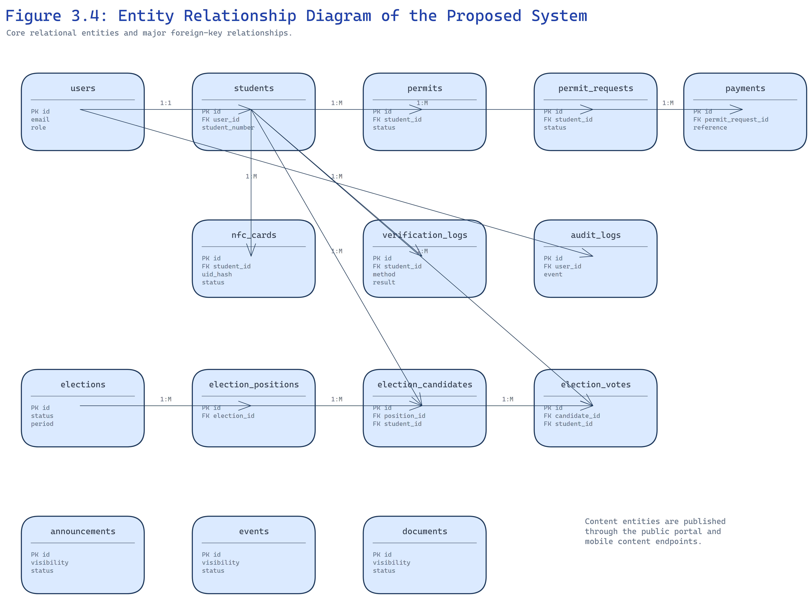
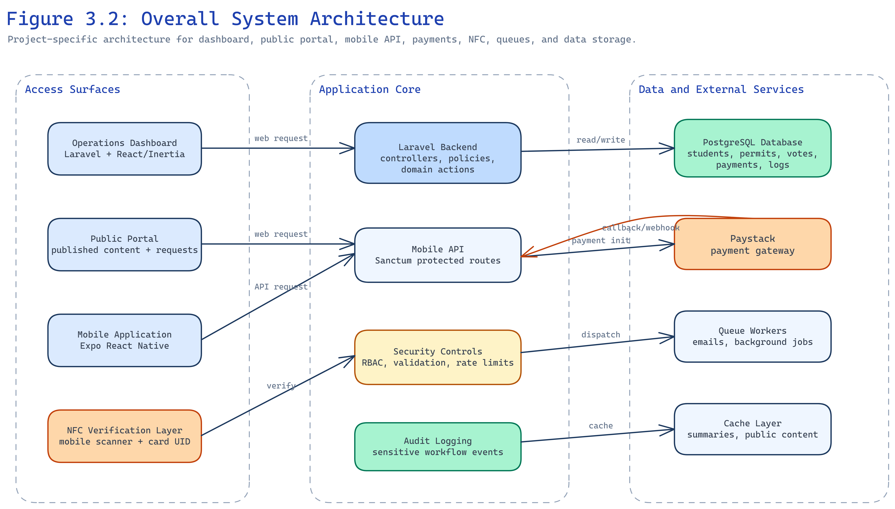
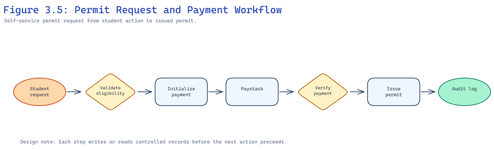
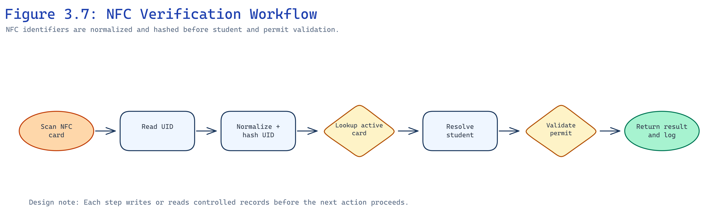

# CHAPTER THREE — SYSTEM ANALYSIS AND DESIGN

## 3.1 Introduction

This chapter explains how the proposed system was analyzed and designed. It covers the existing manual processes, requirements of the proposed system, database and logic design, user interface design, and the test plan.

## 3.2 Analysis of the Existing System

### 3.2.1 Detailed Description of the Existing System

SRC permit and governance activities at Knutsford University have relied on manual forms, physical permit cards, paper payment receipts, notice boards, and informal messaging for announcements and elections. Verification officers check names against printed lists or inspect physical cards. Permit payments are confirmed manually before cards are issued. Elections may use paper lists or disconnected online tools without linkage to permit eligibility.

### 3.2.2 Challenges Associated with the Existing System

The manual approach causes slow verification during examinations and events, weak audit trails, payment mismatches, duplicate or altered permits, inconsistent public information, and election disputes when eligibility cannot be reconstructed afterward.

### 3.2.3 Detailed Definition of the Problem (System Request)

The institution requires a centralized platform where students, executives, and staff can manage permits, verify identity using NFC or fallback codes, confirm Paystack payments server-side, vote in controlled elections, publish official content, and review operational reports with role-based access and audit logs.

## 3.3 Analysis of the Proposed System

### 3.3.1 Requirements of the Proposed System

#### 3.3.1.1 Functional and Non-Functional Requirements

**Functional requirements** include student and account management, permit issuance and revocation, permit request and payment workflows, NFC registration and verification, election setup and voting, public content management, audit logging, and reporting.

**Non-functional requirements** include secure authentication, authorization checks on every sensitive action, responsive web and mobile interfaces, queue-backed background jobs, data validation, and protection of sensitive identifiers such as hashed NFC UIDs.

Table 3.1 summarizes priority functional requirements.

| ID | Requirement | Priority |
| --- | --- | --- |
| FR-01 | Register and manage student records | High |
| FR-02 | Issue, revoke, and verify permits | High |
| FR-03 | Process permit requests with Paystack verification | High |
| FR-04 | Register NFC cards and verify by tap | High |
| FR-05 | Conduct elections with eligibility enforcement | High |
| FR-06 | Publish announcements, events, and documents | Medium |
| FR-07 | Record audit logs for sensitive actions | High |
| FR-08 | Generate operational reports | Medium |

Table 3.1: Selected Functional Requirements

#### 3.3.1.2 User Interface Requirements

The operations dashboard must support searchable tables, status badges, filters, and role-aware navigation. The public portal must present readable content and self-service permit request forms. The mobile application must provide clear permit status, payment progress, election screens, and staff verification views.

#### 3.3.1.3 System Requirements (Hardware, Software, Platform)

**Hardware:** Web server, PostgreSQL database server, optional Redis, SSL termination, NFC-capable mobile devices for field verification.

**Software:** PHP 8.4, Laravel 13, Node.js build chain, Expo SDK, PostgreSQL 15+, Paystack account, queue worker processes.

### 3.4 Design and Architecture of the Proposed System

#### 3.4.1 Database Design

The database stores students, users, roles, permissions, permits, permit requests, payments, NFC cards, elections, candidates, votes, content, and audit events. Figure 3.4 shows the entity relationship model.

Figure 3.4: Entity Relationship Diagram of the Proposed System

Core relationships link students to permits and NFC cards, permit requests to payments, and elections to positions, candidates, and votes.

#### 3.4.2 System Logic Design

Figure 3.2 presents the overall system architecture connecting the dashboard, public portal, mobile application, API layer, queues, cache, database, and Paystack.

Figure 3.2: Overall System Architecture

Figure 3.5 shows the permit request and payment workflow from student submission through Paystack verification to permit issuance.

Figure 3.5: Permit Request and Payment Workflow

Figure 3.7 shows NFC verification from card tap through server lookup to permit status response and audit logging.

Figure 3.7: NFC Verification Workflow

#### 3.4.3 User Interface Design

[INSERT FIGURE — Dashboard Wireframe or Student Management Screen]

Figure 3.15: Operations Dashboard Layout (placeholder)

The dashboard groups modules for students, permits, verification, elections, content, reports, and settings. The mobile application uses tab navigation for home, permits, elections, and profile. The public portal emphasizes announcements and permit request entry points.

#### 3.4.4 System Test Plan

Testing will cover authentication, RBAC restrictions, permit lifecycle, Paystack callback handling, NFC registration and verification, election eligibility, mobile API tokens, and public content visibility. Feature tests use Pest; manual screenshots document user interface evidence in Chapter Four.

### 3.5 Security and Mobile API Design

Security design separates public routes, authenticated dashboard routes, and Sanctum-protected mobile routes. Sensitive actions such as permit issuance, payment recovery, NFC revocation, and candidate approval require both authentication and permission checks. The mobile API returns resource-oriented JSON responses and validation errors so the mobile client can display field-level messages.

Election voting applies stricter rules than informal polls: the backend confirms election window, approved candidate, linked student, active account, and permit eligibility before accepting a vote. Verification endpoints write audit records that include method (NFC, student number, or permit code), result, and acting user.

### 3.6 Queue, Cache, and Reporting Design

Queued jobs handle mail notifications, payment follow-up, and other asynchronous work so web requests remain responsive. Cache is applied selectively to reference data while permit validity and vote eligibility always query authoritative records. Reporting modules aggregate counts for permits nearing expiry, students without activated accounts, unpaid or stuck permit requests, and recent verification failures to support executive oversight.
