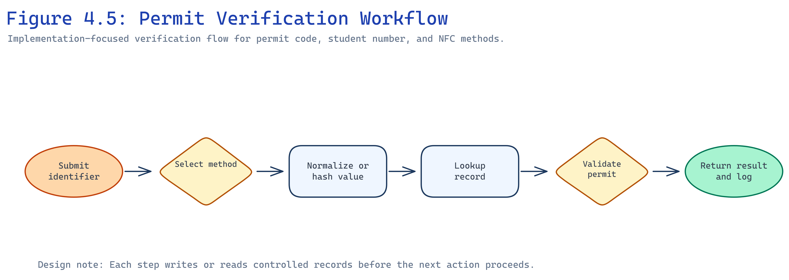
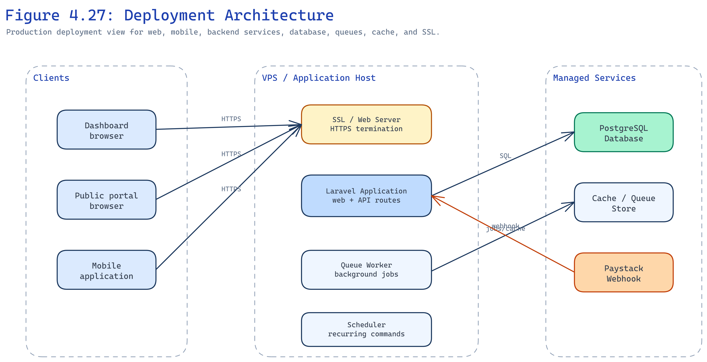

# CHAPTER FOUR — SYSTEM IMPLEMENTATION

## 4.1 Introduction

This chapter describes how the proposed system was implemented. It presents the programming languages and technologies used, development frameworks, coding evidence, testing results, and deployment documentation.

## 4.2 Programming Languages and Technologies Applied

**PHP 8.4** implements server logic, validation, policies, and API resources. **TypeScript and React** build the Inertia dashboard and public-facing pages. **TypeScript with Expo React Native** implements the mobile client. **SQL** defines PostgreSQL schema through Laravel migrations. **JavaScript** supports Vite bundling and tooling.

PHP and Laravel were selected because the team required mature routing, ORM, queues, and API tooling in one framework. React and Inertia allow server-driven navigation with rich components without a separate SPA authentication layer. Expo reduces mobile build complexity for Android and iOS targets.

## 4.3 Frameworks and Development Platforms/Tools

| Layer | Technology | Role |
| --- | --- | --- |
| Backend | Laravel 13, Fortify, Sanctum | Web auth, mobile tokens, domain logic |
| Frontend | React 19, Inertia v3, Tailwind CSS v4 | Dashboard and portal UI |
| Mobile | Expo React Native | Student and staff mobile client |
| Database | PostgreSQL | Persistent storage |
| Payments | Paystack API | Initialization and verification |
| Authorization | Spatie Permission | RBAC |
| Testing | Pest 4 | Feature and unit tests |
| Build | Vite, Wayfinder | Asset bundling and typed routes |

Development used Laravel Herd for local hosting, Git for version control, and PNPM for frontend dependencies.

## 4.4 Coding Evidence

The backend organizes domain logic into models, policies, form requests, and controllers. Mobile routes are grouped under `routes/api.php` with Sanctum middleware. Permit payment verification runs in dedicated action classes that validate Paystack references before completing requests.

```php
// Illustrative pattern: server-side payment verification before permit completion
$payment = Paystack::verify($reference);
if ($payment->isSuccessful()) {
    $permitRequest->markPaid($payment);
}
```

NFC UIDs are normalized and hashed before storage so raw identifiers are not kept in plain text. Election votes are stored with constraints preventing duplicate votes per student and position.

[INSERT FIGURE — Login Interface]

Figure 4.1: Login Interface

[INSERT FIGURE — Student Management Dashboard]

Figure 4.2: Student Management Dashboard

[INSERT FIGURE — Permit Management Screen]

Figure 4.3: Permit Management Screen

[INSERT FIGURE — NFC Verification Screen]

Figure 4.4: NFC Verification Screen

Figure 4.5 shows the permit verification workflow connecting NFC, student number, and permit code paths.



Figure 4.5: Permit Verification Workflow

[INSERT FIGURE — Election Dashboard]

Figure 4.6: Election Dashboard

[INSERT FIGURE — Mobile Voting Screen]

Figure 4.7: Mobile Voting Screen

[INSERT FIGURE — Student Home Screen]

Figure 4.8: Student Home Screen (Mobile)

## 4.5 Testing Results and Evidence

Automated tests cover authentication, permit issuance rules, payment recovery, NFC lifecycle, election constraints, and API authorization. Table 4.1 summarizes selected results.

| Module | Tests executed | Outcome |
| --- | --- | --- |
| Authentication | Login, 2FA, password setup | Passed |
| Permits | Issue, revoke, verify | Passed |
| Payments | Callback verification, recovery | Passed |
| NFC | Register, verify, revoke card | Passed |
| Elections | Eligibility, duplicate vote prevention | Passed |
| Mobile API | Token access, student scoping | Passed |
| Authorization | Role and permission restrictions | Passed |

Table 4.1: System Testing Results Summary

[INSERT FIGURE — Audit Logs Dashboard]

Figure 4.9: Audit Logs Dashboard (optional evidence)

## 4.6 Deployment and User/System Documentation

Figure 4.10 outlines deployment architecture with web server, database, queue workers, scheduler, and SSL.



Figure 4.10: Deployment Architecture

**User documentation:** Students use the mobile app or public portal for permits and elections. Staff use dashboard verification and permit modules. Executives publish content and review reports.

**System documentation:** Environment variables configure database, Paystack keys, queue connection, and mail. Queue workers process notifications; the scheduler runs `php artisan schedule:run` via cron. Production requires HTTPS, backups, and masked test data in screenshots.

**Administrator setup:** Create roles and permissions, import or register students, configure permit types and fees, register NFC cards, and open election windows with approved candidates.

### 4.7 Backend Module Implementation Summary

The **student module** supports registration fields, account activation links, and linkage between user accounts and student records. The **permit module** manages permit types, issuance, revocation, duplicate checks, and verification responses. The **permit request module** exposes public and mobile creation endpoints, initializes Paystack transactions, and completes requests only after verified payment or authorized recovery.

The **NFC module** registers cards, stores hashed identifiers, supports replacement and revocation, and exposes verification to dashboard and mobile staff tools. The **election module** manages positions, candidates, approvals, voting windows, and result visibility. The **content module** publishes announcements, events, documents, and executive profiles to the public portal. The **audit and reports modules** record sensitive events and surface operational summaries for administrators.

### 4.8 Mobile Application Implementation

The Expo application provides authentication, student home, permit list and request flows, election browsing and voting, profile access, and staff verification screens where permitted. API calls attach Sanctum tokens and handle 401 responses by redirecting to login. NFC scanning is invoked only on supported devices; fallback entry uses student number or permit code through the same backend verification service.

### 4.9 Challenges Encountered

Integration between Paystack callbacks, queue workers, and permit state required careful ordering to avoid duplicate completion. NFC UID normalization across device vendors required consistent uppercase hex handling before hashing. Election testing needed realistic position and candidate seed data to validate eligibility paths. These issues were resolved through feature tests and manual verification using anonymized test records.
