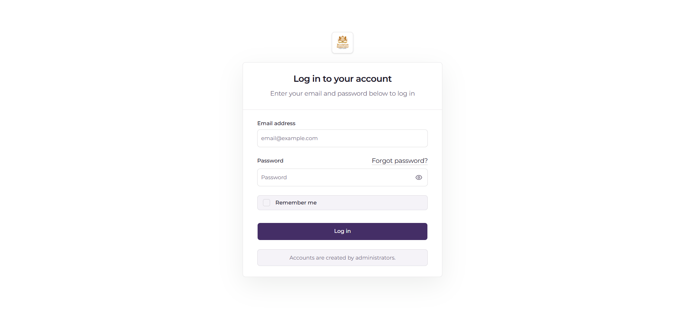

# Screenshot Capture Guide

This guide lists the screenshots still required for the dissertation and explains how to store them so they can be inserted into the chapters without confusion. It should be used together with `FIGURES_AND_TABLES_INDEX.md`, `REPORT_WRITING_RULES.md`, and the figure placeholders already written in Chapters Three and Four.

The diagrams have already been generated and stored separately under `academic-documentation/diagrams/`. This document is only for application screenshots.

## 1. Storage Structure

Store final screenshots in the following folder:

```txt
academic-documentation/screenshots/
```

Use subfolders by chapter:

```txt
academic-documentation/screenshots/chapter-3/
academic-documentation/screenshots/chapter-4/
academic-documentation/screenshots/appendix/
```

Use PNG format for all final screenshots unless there is a strong reason to use another format. PNG is preferred because it preserves interface text clearly.

## 2. File Naming Convention

Use this format:

```txt
figure-<chapter>-<number>-<short-title>.png
```

Examples:

```txt
figure-4-1-login-interface.png
figure-4-10-nfc-verification-screen.png
figure-4-19-student-home-screen.png
```

Keep filenames lowercase, use hyphens instead of spaces, and match the figure number used in the chapter.

## 3. General Screenshot Rules

Capture screenshots from a clean test environment. Do not use real student data unless the information is already public or has been anonymized.

Before taking screenshots:

- Use test student names, test student numbers, and test election records.
- Hide or blur emails, phone numbers, payment references, raw NFC UIDs, tokens, and private identifiers.
- Use consistent browser zoom, preferably 100%.
- Use a clean desktop with no personal notifications visible.
- Avoid capturing unnecessary browser chrome unless the URL is useful for context.
- Prefer light mode unless the application is intentionally designed for dark mode.
- Make sure table rows, status badges, buttons, and labels are readable.
- Avoid empty screens. Each screenshot should show realistic sample data.
- Do not crop so tightly that the reader cannot understand the screen context.

## 4. Recommended Screenshot Sizes

Use consistent sizes so the final report looks organized.

| Screenshot Type | Recommended Size | Notes |
| --- | --- | --- |
| Dashboard/web screenshots | 1440 x 900 or 1366 x 768 | Best for dashboard, reports, audit logs, and public portal screens. |
| Mobile screenshots | 390 x 844, 393 x 852, or similar | Use one mobile device size consistently where possible. |
| Verification result screenshots | 900 x 700 or full dashboard width | Capture the input area and result card together. |
| Public portal screenshots | 1440 x 900 | Show enough of the page to identify it as the public portal. |
| Appendix screenshots | Flexible | Use appendix only for extra proof screens not needed in the main chapter. |

## 5. Chapter Three Screenshots

Chapter Three mostly uses diagrams, but it includes interface design placeholders. These may be actual screenshots if the implemented interface is already stable.

| Figure No. | Required Screenshot | Save As | Location | Priority | Notes |
| --- | --- | --- | --- | --- | --- |
| Figure 3.12 | Operations Dashboard Interface | `figure-3-12-operations-dashboard-interface.png` | `screenshots/chapter-3/` | Optional | Capture dashboard overview with navigation, summary cards, warnings, and recent activity. This may duplicate Chapter Four if necessary. |
| Figure 3.13 | Student Mobile Home Screen | `figure-3-13-student-mobile-home-screen.png` | `screenshots/chapter-3/` | Optional | Use only if Chapter Three needs UI design evidence. Otherwise keep the main mobile screenshot in Chapter Four. |
| Figure 3.14 | Student Permit Request Screen | `figure-3-14-student-permit-request-screen.png` | `screenshots/chapter-3/` | Optional | Capture the form or request flow using test data. |
| Figure 3.15 | Election Voting Screen | `figure-3-15-election-voting-screen.png` | `screenshots/chapter-3/` | Optional | Capture candidate selection screen with test candidates. |
| Figure 3.16 | Verification Interface | `figure-3-16-verification-interface.png` | `screenshots/chapter-3/` | Optional | Capture verification input and result area. |

If the report becomes too screenshot-heavy, keep Chapter Three focused on diagrams and move most UI screenshots to Chapter Four.

## 6. Chapter Four Required Screenshots

Chapter Four is the main implementation evidence chapter. These screenshots should be prioritized.

| Figure No. | Required Screenshot | Save As | Location | Priority | Notes |
| --- | --- | --- | --- | --- | --- |
| Figure 4.1 | Login Interface | `figure-4-1-login-interface.png` | `screenshots/chapter-4/` | Required | Capture dashboard login screen. Use clean branding and no saved browser password prompts. |
| Figure 4.2 | Student Management Dashboard | `figure-4-2-student-management-dashboard.png` | `screenshots/chapter-4/` | Required | Show student table, filters/search, status indicators, and actions. Use test records. |
| Figure 4.4 | Permit Management Screen | `figure-4-4-permit-management-screen.png` | `screenshots/chapter-4/` | Required | Show permit records, status badges, filters, and available actions. |
| Figure 4.6 | Permit Request Screen | `figure-4-6-permit-request-screen.png` | `screenshots/chapter-4/` | Required | Capture public or mobile permit request screen. Use test permit type and academic period. |
| Figure 4.8 | Permit Request Recovery Dashboard | `figure-4-8-permit-request-recovery-dashboard.png` | `screenshots/chapter-4/` | Required | Show recovery states, retry actions, or pending payment verification records. |
| Figure 4.9 | NFC Card Registration | `figure-4-9-nfc-card-registration.png` | `screenshots/chapter-4/` | Required | Capture card assignment/register screen. Mask raw UID if visible. |
| Figure 4.10 | NFC Verification Screen | `figure-4-10-nfc-verification-screen.png` | `screenshots/chapter-4/` | Required | Show scan result or verification result card. Mask private student data if real. |
| Figure 4.11 | Verification Dashboard | `figure-4-11-verification-dashboard.png` | `screenshots/chapter-4/` | Required | Show student number, permit code, and NFC verification options if available. |
| Figure 4.12 | Election Dashboard | `figure-4-12-election-dashboard.png` | `screenshots/chapter-4/` | Required | Show election status, positions, candidates, or approval workflow. |
| Figure 4.13 | Mobile Voting Screen | `figure-4-13-mobile-voting-screen.png` | `screenshots/chapter-4/` | Required | Capture candidate selection or vote confirmation screen with test candidates. |
| Figure 4.14 | Election Results Screen | `figure-4-14-election-results-screen.png` | `screenshots/chapter-4/` | Required | Show summarized results. Do not expose individual voter identity. |
| Figure 4.15 | Announcement Management | `figure-4-15-announcement-management.png` | `screenshots/chapter-4/` | Required | Show announcement list, publication status, or create/edit workflow. |
| Figure 4.16 | Public Portal | `figure-4-16-public-portal.png` | `screenshots/chapter-4/` | Required | Capture homepage or content listing with announcements/events/documents visible. |
| Figure 4.17 | Audit Logs Dashboard | `figure-4-17-audit-logs-dashboard.png` | `screenshots/chapter-4/` | Required | Show filters and event records. Use seed data or mask names. |
| Figure 4.18 | Reports Dashboard | `figure-4-18-reports-dashboard.png` | `screenshots/chapter-4/` | Required | Show operational summaries, counts, warnings, and report filters. |
| Figure 4.19 | Student Home Screen | `figure-4-19-student-home-screen.png` | `screenshots/chapter-4/` | Required | Capture the mobile student landing screen with main actions visible. |
| Figure 4.20 | Permit Request Mobile Screen | `figure-4-20-permit-request-mobile-screen.png` | `screenshots/chapter-4/` | Required | Capture the mobile permit request form or confirmation screen. |
| Figure 4.21 | Mobile Permit Status Screen | `figure-4-21-mobile-permit-status-screen.png` | `screenshots/chapter-4/` | Required | Show active/pending permit state and validity period using test data. |
| Figure 4.22 | Operations Verification Screen | `figure-4-22-operations-verification-screen.png` | `screenshots/chapter-4/` | Required | Capture mobile operations verification flow if available. |
| Figure 4.23 | Card Assignment Screen | `figure-4-23-card-assignment-screen.png` | `screenshots/chapter-4/` | Required | Show NFC card assignment to a student record. Mask UID if visible. |
| Figure 4.26 | Test Execution Results | `figure-4-26-test-execution-results.png` | `screenshots/chapter-4/` | Required | Capture terminal or test runner output after a clean test run. |

The following Chapter Four figures are already diagrams and do not require screenshots:

| Figure No. | Asset Already Available |
| --- | --- |
| Figure 4.3 | Student Account Activation Workflow diagram |
| Figure 4.5 | Permit Verification Workflow diagram |
| Figure 4.7 | Paystack Payment Flow diagram |
| Figure 4.24 | Mobile API Communication Flow diagram |
| Figure 4.25 | Queue Workflow diagram |
| Figure 4.27 | Deployment Architecture diagram |

## 7. Optional Appendix Screenshots

Use the appendix for supporting evidence that is useful but too detailed for Chapter Four.

| Screenshot | Suggested Filename | Notes |
| --- | --- | --- |
| Successful payment callback record | `appendix-payment-callback-success.png` | Mask transaction reference if needed. |
| Failed payment recovery case | `appendix-payment-recovery-failed-case.png` | Useful for explaining recovery workflows. |
| Valid permit verification result | `appendix-valid-permit-verification.png` | Can support verification testing. |
| Invalid or expired permit result | `appendix-invalid-permit-verification.png` | Useful if Chapter Four discusses negative testing. |
| NFC card replacement record | `appendix-nfc-card-replacement.png` | Show lifecycle handling. |
| Role and permission management screen | `appendix-role-permission-management.png` | Useful for RBAC evidence. |
| API response sample from mobile endpoint | `appendix-mobile-api-response.png` | Capture API tool only if needed. Avoid tokens. |
| Queue worker running successfully | `appendix-queue-worker-output.png` | Useful for deployment evidence. |

## 8. Data Preparation Before Capturing

Prepare a small, clean set of test data before taking screenshots:

| Data Type | Recommended Test Data |
| --- | --- |
| Student | Use two or three test students with realistic but fake names and student numbers. |
| Permit | Include at least one active permit, one pending request, and one expired or revoked permit if available. |
| Payment | Use Paystack test mode or clearly test-labelled payment records. |
| NFC card | Use one active card and one revoked/lost example if the screen supports it. |
| Election | Use a test SRC election with two positions and two or more candidates. |
| Announcement/event/document | Use official-looking but fake governance content. |
| Audit logs | Generate actions such as login, permit verification, payment verification, and election update. |

## 9. How to Insert Screenshots Later

When a screenshot is ready, replace the placeholder in the chapter with Markdown image syntax.

Example:

```md


Figure 4.1: Login Interface
```

After inserting screenshots:

- Keep the figure caption below the image.
- Make sure the figure is discussed before and after it.
- Change “should show” wording to present tense, such as “Figure 4.1 shows...”.
- Confirm that the image path works from the chapter file.

## 10. Screenshot Capture Checklist

Use this checklist before final report assembly:

| Item | Status | Notes |
| --- | --- | --- |
| All required Chapter Four screenshots captured | Pending | Complete Figures 4.1, 4.2, 4.4, 4.6, 4.8-4.23, and 4.26. |
| Optional Chapter Three UI screenshots captured or intentionally skipped | Pending | Avoid duplicating too many Chapter Four screenshots. |
| All screenshots stored in correct folder | Pending | Use `screenshots/chapter-3/`, `screenshots/chapter-4/`, or `screenshots/appendix/`. |
| File names match figure numbers | Pending | Use lowercase hyphenated filenames. |
| Sensitive data masked or replaced with test data | Pending | Check student records, payments, NFC identifiers, and tokens. |
| Screenshots are clear and readable | Pending | Check image resolution and text size. |
| Placeholders replaced in chapters | Pending | Replace only after final screenshot is selected. |
| Figure captions verified | Pending | Captions must match chapter numbering. |
| Table of figures updated during Word assembly | Pending | Perform after all figures are inserted. |

## 11. Minimum Screenshot Set

If time becomes limited, capture these first:

1. Figure 4.1: Login Interface
2. Figure 4.2: Student Management Dashboard
3. Figure 4.4: Permit Management Screen
4. Figure 4.6: Permit Request Screen
5. Figure 4.9: NFC Card Registration
6. Figure 4.10: NFC Verification Screen
7. Figure 4.12: Election Dashboard
8. Figure 4.13: Mobile Voting Screen
9. Figure 4.16: Public Portal
10. Figure 4.17: Audit Logs Dashboard
11. Figure 4.18: Reports Dashboard
12. Figure 4.19: Student Home Screen
13. Figure 4.26: Test Execution Results

This minimum set gives the dissertation enough visual evidence to demonstrate authentication, student management, permit handling, NFC verification, elections, public communication, reporting, auditability, mobile access, and testing.

## 12. Readiness Summary

The screenshot process should produce a clean, numbered set of PNG files that directly match the figure placeholders in Chapters Three and Four. The most important screenshots belong in Chapter Four because that chapter provides implementation evidence. Chapter Three screenshots may be used sparingly for interface design discussion, while additional proof screens can be stored in the appendix.
